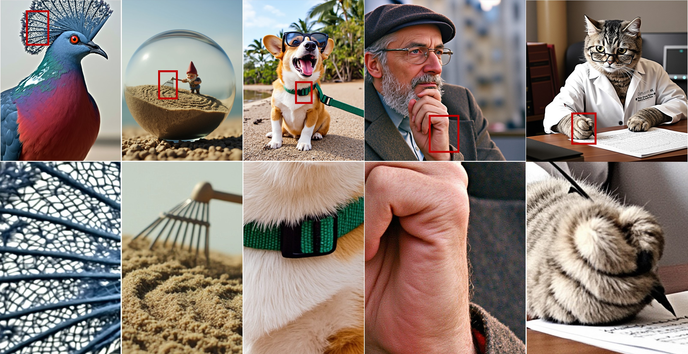
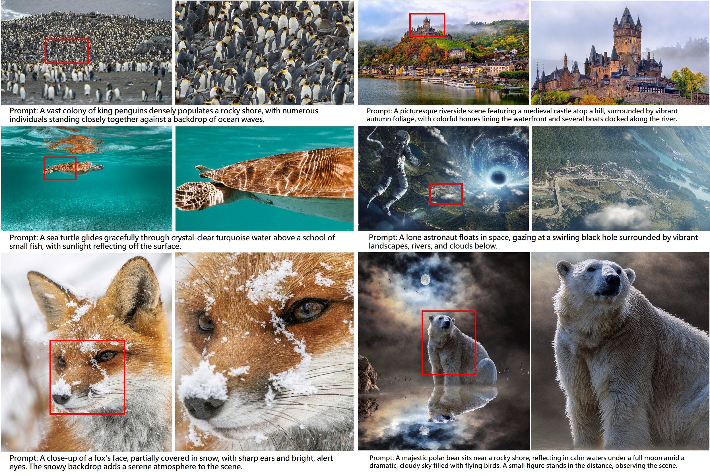

# Diffusion-4K: Ultra-High-Resolution Image Synthesis with Latent Diffusion Models (CVPR 2025)


<div align="center">
  <a href="https://arxiv.org/abs/2503.18352"></a> &ensp;
  <a href="https://huggingface.co/datasets/zhang0jhon/Aesthetic-4K"></a> &ensp;
</div>


<p align="center" border-raduis="10px">
  
</p>


## Updates
[2025/06/03] We release the updated checkpoint [flux_wavelet_v2_sc](https://huggingface.co/zhang0jhon/flux_wavelet_v2_sc) and [Aesthetic-Train-V2](https://huggingface.co/datasets/zhang0jhon/Aesthetic-Train-V2). 

Please refer to our new arxiv paper [Ultra-High-Resolution Image Synthesis: Data, Method and Evaluation](https://arxiv.org/abs/2506.01331).

The training code of SC-VAE is released at [sc-vae](https://github.com/zhang0jhon/diffusion-4k/tree/main/sc-vae).


## Introduction

We present Diffusion-4K, a novel framework for direct ultra-high-resolution image synthesis using text-to-image diffusion models.
The core advancements include:

(1) **Aesthetic-4K Benchmark**: addressing the absence of a publicly available 4K image synthesis dataset, we construct Aesthetic-4K, a comprehensive benchmark for ultra-high-resolution image generation.
We curated a high-quality 4K dataset with carefully selected images and captions generated by GPT-4o.
Additionally, we introduce GLCM Score and Compression Ratio metrics to evaluate fine details, combined with holistic measures such as FID, Aesthetics and CLIPScore for a comprehensive assessment of ultra-high-resolution images.

(2) **Wavelet-based Fine-tuning**: we propose a wavelet-based fine-tuning approach for direct training with photorealistic 4K images, applicable to various latent diffusion models, demonstrating its effectiveness in synthesizing highly detailed 4K images.

Consequently, Diffusion-4K achieves impressive performance in high-quality image synthesis and text prompt adherence, especially when powered by modern large-scale diffusion models (e.g., SD3-2B and Flux-12B).


## Aesthetic-4K Dataset

* Aesthetic-4K dataset is released at [huggingface](https://huggingface.co/datasets/zhang0jhon/Aesthetic-4K).

<p align="center" border-raduis="10px">
  
</p>

## Installation
Install the required packages:

```
pip install -r requirements.txt
```

Download the [dataset](https://huggingface.co/datasets/zhang0jhon/Aesthetic-4K) in *Aesthetic-4K* folder, and the pretrained latent diffusion models([SD3-2B](https://huggingface.co/stabilityai/stable-diffusion-3-medium-diffusers) and [Flux-12B](https://huggingface.co/black-forest-labs/FLUX.1-dev)) in *pretrain* folder.


## Training
Modify the configuration in *ds_config.yaml* accordingly (*e.g.* num_processes), and then run the script for training Flux-12B:

```
sh train_flux.sh
```

Run the script for training SD3-2B:

```
sh train_sd3.sh
```

## Checkpoint

Flux-12B-WLF checkpoint is released at [flux_wavelet](https://huggingface.co/zhang0jhon/flux_wavelet).

## Image Generation
Generate images with Flux-12B:

```
CUDA_VISIBLE_DEVICES=0 python test_flux.py --guidance_scale 5.0 --height 3072 --width 4096 --seed 0 --num_inference_steps 50 --checkpoint_path $CHECKPOINT_PATH --prompt $PROMPT
```

Generate images with SD3-2B:

```
CUDA_VISIBLE_DEVICES=0 python test_sd3.py --guidance_scale 7.0 --height 3072 --width 4096 --seed 0 --num_inference_steps 28 --checkpoint_path $CHECKPOINT_PATH --prompt $PROMPT
```

<!-- You can modify the paramters of height, width, guiduance scale and random seed for various images generation.
```
for height, width in [(4096, 4096), (4096, 3072), (3072, 4096)]: 
  for guidance_scale in [5, 5.5, 6, 6.5, 7]: 
    for num_inference_steps in [50, 80, 100]: 
        for seed in range(10):
          # generate images.
``` -->

## Tips
For 4K image generation, it is recommended to generate at the resolution of (4096, 3072) or (3072, 4096) with guidance scale of 5 or 5.5.

## Evaluation 
Generate images for evaluation and compute FID, CLIPScore and Aesthetics:

```
python generate_and_eval_fid.py --size 2048 --checkpoint_path $CHECKPOINT_PATH --save_path $SAVE_PATH
```

Compute GLCM Score and Compression Ratio with generated images:

```
python eval.py --size 2048 --img_root $SAVE_PATH
```

## Acknowledgement

We are grateful for the following awesome projects and models when implementing Diffusion-4K:

* [Diffusers](https://github.com/huggingface/diffusers).
* [Transformers](https://github.com/huggingface/transformers).
* [SD3](https://huggingface.co/stabilityai/stable-diffusion-3-medium-diffusers).
* [Flux](https://huggingface.co/black-forest-labs/FLUX.1-dev).
* [CLIP+MLP Aesthetic Score Predictor](https://github.com/christophschuhmann/improved-aesthetic-predictor).

## Citation

If you find our paper or dataset is helpful in your research or applications, generously cite with:

```
@inproceedings{zhang2025diffusion4k,
    title={Diffusion-4K: Ultra-High-Resolution Image Synthesis with Latent Diffusion Models},
    author={Zhang, Jinjin and Huang, Qiuyu and Liu, Junjie and Guo, Xiefan and Huang, Di},
    year={2025},
    booktitle={IEEE/CVF Conference on Computer Vision and Pattern Recognition (CVPR)},
}

@misc{zhang2025ultrahighresolutionimagesynthesis,
    title={Ultra-High-Resolution Image Synthesis: Data, Method and Evaluation},
    author={Zhang, Jinjin and Huang, Qiuyu and Liu, Junjie and Guo, Xiefan and Huang, Di},
    year={2025},
    note={arXiv:2506.01331},
}
```