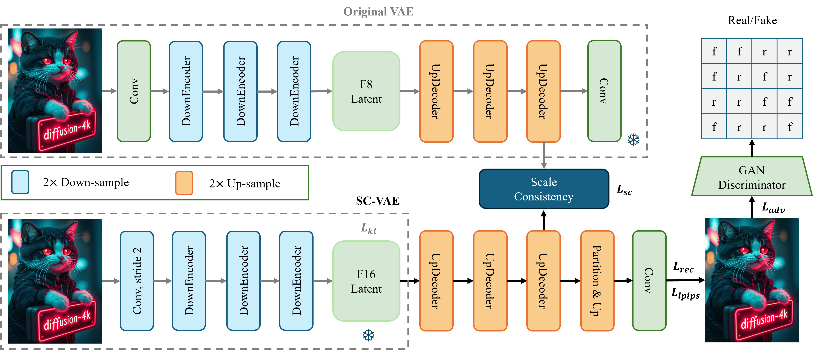

# Scale Consistent VAE

<div align="center">
  <a href="https://arxiv.org/abs/2506.01331"></a> &ensp;
</div>


<p align="center" border-raduis="10px">
  
</p>


## Data
Download and prepare [SA-1B](https://ai.meta.com/datasets/segment-anything/) dataset in **data/sa-1b** folder.
<!-- TREEVIEW START -->
```bash
├── data/
│   ├── metadata_vae_sa1b.jsonl
│   ├── sa-1b/
│   │   ├── sa_000000/
│   │   │── ...
│   │   └── sa_000999/
```
<!-- TREEVIEW END -->


## Training
Run the script for training Flux-F16-SC-VAE for Flux-12B:

```
sh train_vae.sh
```